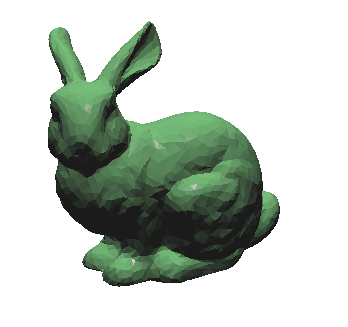

# Рисование 3D кролика из obj файла с применением теней
---------------------

## Flat bunny:

модель без теней (так как резкие грани - ошибка загрузчика `obj` модели, а не моя, то решил, что, по идеи, можно и не исправлять):

## Модели с одним иерархическим уровнем теневой карты:

-----------------------

Управление камерой с помощью мышки. Модели двигаются сами, т.е. не расчитаны, чтобы их кто-то мог перемещать.

